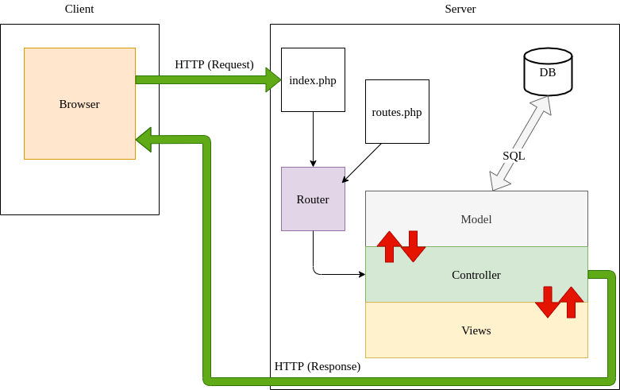
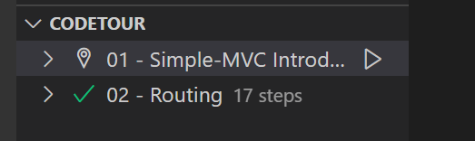

# Ani Rent

## Context

Ani Rent is the winner student project of a team Hackathon organized by the Wild Code School Orléans. The Hackathon theme was "Travel" and required to use at least one API. It took place from the 24 novembre, 9AM, to the 25 novembre, 2PM, 2022. The teams were made of 4 members

The project is made on a simple PHP MVC structure made by the Wild Code School, wich you'll find more informations about lower on this readme. Here is the link to the repository : https://github.com/WildCodeSchool/simple-mvc.

## Description

Ani Rent is a fictive entreprise which rent mounts to travel with, only in France. It is a quirky and unrealistic idea made to be original for the hackathon so don't expect to be able to mount a mosquito soon :p.

How to navigate :

1. Pick two adresses from France, don't mention the city. Exemple -> adress:'1 rue de l'adresse' postcode:'10000'
2. Select the mount that you prefer.
3. Confirm the cart.
4. Enter your coordinates.
5. Go to \*/admin to see the list of orders you made.

## Setup

1. Clone the repo.
2. Follow the steps stated on the Simple MVC readme (or just scroll down to get them).
3. Enter your API keys to the _config/api_keys.php_ as demonstrated in the _config/api_keys.php.dist_ file.
4. Start navigate !

## Credits

The API used to create this project are the following :

1. https://api-ninjas.com/api/animals
2. https://adresse.data.gouv.fr/api-doc/adresse
3. google maps api

## The team

Kevyn SOLAS : https://github.com/Planger45
Mickaël GALLÉ : https://github.com/toomanyMG
Hughes HERTOUT : https://github.com/hhertout
Valentin GILLET : https://github.com/V-Gillet

---

# Simple MVC

## Description

This repository is a simple PHP MVC structure from scratch.

It uses some cool vendors/libraries such as Twig and Grumphp.
For this one, just a simple example where users can choose one of their databases and see tables in it.

## Steps

1. Clone the repo from Github.
2. Run `composer install`.
3. Create _config/db.php_ from _config/db.php.dist_ file and add your DB parameters. Don't delete the _.dist_ file, it must be kept.
4. Database name is `anirent`.

```php
define('APP_DB_HOST', 'your_db_host');
define('APP_DB_NAME', 'your_db_name');
define('APP_DB_USER', 'your_db_user_wich_is_not_root');
define('APP_DB_PASSWORD', 'your_db_password');
```

4. Import _database.sql_ in your SQL server, you can do it manually or use the _migration.php_ script which will import a _database.sql_ file.
5. Run the internal PHP webserver with `php -S localhost:8000 -t public/`. The option `-t` with `public` as parameter means your localhost will target the `/public` folder.
6. Go to `localhost:8000` with your favorite browser.
7. From this starter kit, create your own web application.

### Windows Users

If you develop on Windows, you should edit you git configuration to change your end of line rules with this command :

`git config --global core.autocrlf true`

## Example

An example (a basic list of items) is provided (you can load the _simple-mvc.sql_ file in a test database). The accessible URLs are :

-   Home page at [localhost:8000/](localhost:8000/)
-   Items list at [localhost:8000/items](localhost:8000/items)
-   Item details [localhost:8000/items/show?id=:id](localhost:8000/item/show?id=2)
-   Item edit [localhost:8000/items/edit?id=:id](localhost:8000/items/edit?id=2)
-   Item add [localhost:8000/items/add](localhost:8000/items/add)
-   Item deletion [localhost:8000/items/delete?id=:id](localhost:8000/items/delete?id=2)

You can find all these routes declared in the file `src/routes.php`. This is the very same file where you'll add your own new routes to the application.

## How does URL routing work ?



## Ask for a tour !


We prepare a little guided tour to start with the simple-MVC.

To take it, you need to install the `Code Tour` extension for Visual Studio Code : [Code Tour](https://marketplace.visualstudio.com/items?itemName=vsls-contrib.codetour)

It will give access to a new menu on your IDE where you'll find the different tours about the simple-MVC. Click on play to start one :



## Run it on docker

If you don't know what is docker, skip this chapter. ;)

Otherwise, you probably see, this project is ready to use with docker.

To build the image, go into the project directory and in your CLI type:

```
docker build -t simple-mvc-container .
```

then, run it to open it on your localhot :

```
docker run -i -t --name simple-mvc  -p 80:80 simple-mvc-container

```
